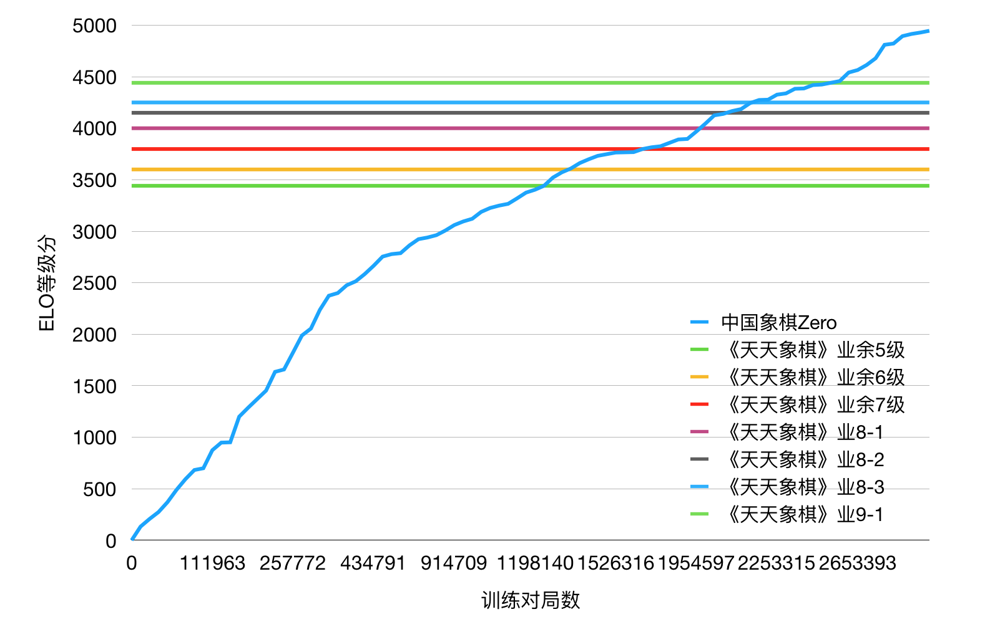

# 中国象棋Zero（CCZero）

## About

Chinese Chess reinforcement learning by [AlphaZero](https://arxiv.org/abs/1712.01815) methods.

This project is based on these main resources:
1. DeepMind's Oct 19th publication: [Mastering the Game of Go without Human Knowledge](https://www.nature.com/articles/nature24270.epdf?author_access_token=VJXbVjaSHxFoctQQ4p2k4tRgN0jAjWel9jnR3ZoTv0PVW4gB86EEpGqTRDtpIz-2rmo8-KG06gqVobU5NSCFeHILHcVFUeMsbvwS-lxjqQGg98faovwjxeTUgZAUMnRQ).
2. The **great** Reversi/Chess/Chinese chess development of the DeepMind ideas that @mokemokechicken/@Akababa/@TDteach did in their repo: https://github.com/mokemokechicken/reversi-alpha-zero, https://github.com/Akababa/Chess-Zero, https://github.com/TDteach/AlphaZero_ChineseChess
3. A Chinese chess engine with gui: https://github.com/mm12432/MyChess


## Help to train

In order to build a strong chinese chess AI following the same type of techniques as AlphaZero, we need to do this with a distributed project, as it requires a huge amount of computations.

If you want to join us to build the best chinese chess AI in the world:

* For instructions, see [wiki](https://github.com/NeymarL/ChineseChess-AlphaZero/wiki)
* For live status, see https://cczero.org




## Environment

* Python 3.6.3
* tensorflow-gpu: 1.3.0
* Keras: 2.0.8


## Modules

### Reinforcement Learning

This AlphaZero implementation consists of two workers: `self` and  `opt`.

* `self` is Self-Play to generate training data by self-play using BestModel.
* `opt` is Trainer to train model, and generate new models.

For the sake of faster training, another two workers are involved:

* `sl` is Supervised learning to train data crawled from the Internet.
* `eval` is Evaluator to evaluate the NextGenerationModel with the current BestModel.

### GUI

Requirement: pygame

```bash
python cchess_alphazero/run.py play
```

**Screenshots**


You can choose different board/piece styles and sides, see [play with human](#play-with-human).


## How to use

### Setup

### install libraries
```bash
pip install -r requirements.txt
```

If you want to use CPU only, replace `tensorflow-gpu` with `tensorflow` in `requirements.txt`.

Make sure Keras is using Tensorflow and you have Python 3.6.3+.

### Configuration

**PlayDataConfig**

* `nb_game_in_file, max_file_num`: The max game number of training data is `nb_game_in_file * max_file_num`.

**PlayConfig, PlayWithHumanConfig**

* `simulation_num_per_move` : MCTS number per move.
* `c_puct`: balance parameter of value network and policy network in MCTS.
* `search_threads`: balance parameter of speed and accuracy in MCTS.
* `dirichlet_alpha`: random parameter in self-play.

### Full Usage

```
usage: run.py [-h] [--new] [--type TYPE] [--total-step TOTAL_STEP]
              [--ai-move-first] [--cli] [--gpu GPU] [--onegreen] [--skip SKIP]
              [--ucci] [--piece-style {WOOD,POLISH,DELICATE}]
              [--bg-style {CANVAS,DROPS,GREEN,QIANHONG,SHEET,SKELETON,WHITE,WOOD}]
              [--random {none,small,medium,large}] [--distributed] [--elo]
              {self,opt,eval,play,eval,sl,ob}

positional arguments:
  {self,opt,eval,play,eval,sl,ob}
                        what to do

optional arguments:
  -h, --help            show this help message and exit
  --new                 run from new best model
  --type TYPE           use normal setting
  --total-step TOTAL_STEP
                        set TrainerConfig.start_total_steps
  --ai-move-first       set human or AI move first
  --cli                 play with AI with CLI, default with GUI
  --gpu GPU             device list
  --onegreen            train sl work with onegreen data
  --skip SKIP           skip games
  --ucci                play with ucci engine instead of self play
  --piece-style {WOOD,POLISH,DELICATE}
                        choose a style of piece
  --bg-style {CANVAS,DROPS,GREEN,QIANHONG,SHEET,SKELETON,WHITE,WOOD}
                        choose a style of board
  --random {none,small,medium,large}
                        choose a style of randomness
  --distributed         whether upload/download file from remote server
  --elo                 whether to compute elo score
```

### Self-Play

```
python cchess_alphazero/run.py self
```

When executed, Self-Play will start using BestModel. If the BestModel does not exist, new random model will be created and become BestModel.

options

* `--new`: create new BestModel
* `--type mini`: use mini config, (see `cchess_alphazero/configs/mini.py`)
* `--gpu '1'`: specify which gpu to use
* `--ucci`: whether to play with ucci engine (rather than self play, see `cchess_alphazero/worker/play_with_ucci_engine.py`)
* `--distributed`: run self play in distributed mode which means it will upload the play data to the remote server and download latest model from it

**Note**: To help training, you should run `python cchess_alphazero/run.py --type distribute --distributed self` (and do not change the configuration file `configs/distribute.py`), for more info, see [wiki](https://github.com/NeymarL/ChineseChess-AlphaZero/wiki/For-Developers).

### Trainer

```
python cchess_alphazero/run.py opt
```

When executed, Training will start. The current BestModel will be loaded. Trained model will be saved every epoch as new BestModel.

options

* `--type mini`: use mini config, (see `cchess_alphazero/configs/mini.py`)
* `--total-step TOTAL_STEP`: specify total step(mini-batch) numbers. The total step affects learning rate of training.
* `--gpu '1'`: specify which gpu to use

**View training log in Tensorboard**

```
tensorboard --logdir logs/
```

And access `http://<The Machine IP>:6006/`.

### Play with human

**Run with built-in GUI**

```
python cchess_alphazero/run.py play
```

When executed, the BestModel will be loaded to play against human.

options

* `--ai-move-first`: if set this option, AI will move first, otherwise human move first.
* `--type mini`: use mini config, (see `cchess_alphazero/configs/mini.py`)
* `--gpu '1'`: specify which gpu to use
* `--piece-style WOOD`: choose a piece style, default is `WOOD`
* `--bg-style CANVAS`: choose a board style, default is `CANVAS`
* `--cli`: if set this flag, play with AI in a cli environment rather than gui

**Note**: Before you start, you need to download/find a font file (`.ttc`) and rename it as `PingFang.ttc`, then put it into `cchess_alphazero/play_games`. I have removed the font file from this repo because it's too big, but you can download it from [here](http://alphazero.52coding.com.cn/PingFang.ttc).

You can also download Windows executable directly from [here](https://pan.baidu.com/s/1uE_zmkn0x9Be_olRL9U9cQ). For more information, see [wiki](https://github.com/NeymarL/ChineseChess-AlphaZero/wiki/For-Non-Developers#%E4%B8%8B%E6%A3%8B).

**UCI mode**

```
python cchess_alphazero/uci.py
```

If you want to play in general GUIs such as '冰河五四', you can download the Windows executable [here](https://share.weiyun.com/5cK50Z4). For more information, see [wiki](https://github.com/NeymarL/ChineseChess-AlphaZero/wiki/For-Non-Developers#%E4%B8%8B%E6%A3%8B).

### Evaluator

```
python cchess_alphazero/run.py eval
```

When executed, evaluate the NextGenerationModel with the current BestModel. If the NextGenerationModel does not exist, worker will wait until it exists and check every 5 minutes.

options

* `--type mini`: use mini config, (see `cchess_alphazero/configs/mini.py`)
* `--gpu '1'`: specify which gpu to use

### Supervised Learning

```
python cchess_alphazero/run.py sl
```

When executed, Training will start. The current SLBestModel will be loaded. Tranined model will be saved every epoch as new SLBestModel.

*About the data*

I have two data sources, one is downloaded from https://wx.jcloud.com/market/packet/10479 ; the other is crawled from http://game.onegreen.net/chess/Index.html (with option --onegreen).

options

* `--type mini`: use mini config, (see `cchess_alphazero/configs/mini.py`)
* `--gpu '1'`: specify which gpu to use
* `--onegreen`: if set the flag, `sl_onegreen` worker will start to train data crawled from `game.onegreen.net`
* `--skip SKIP`: if set this flag, games whoses index is less than `SKIP` would not be used to train (only valid when `onegreen` flag is set)
